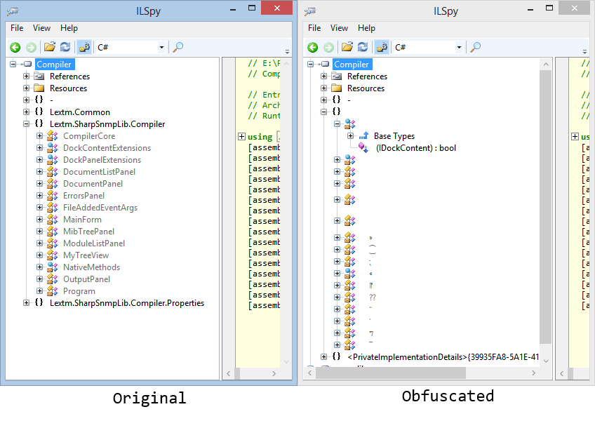

Obfuscar
========

The project logo cames from [Legendora Icon](http://raindropmemory.deviantart.com/art/Legendora-Icon-Set-118999011) by
[Teekatas Suwannakrua](http://raindropmemory.deviantart.com/).

Maintained and supported by [LeXtudio](https://lextudio.com/).

# Project Description
Obfuscar is an open source .NET obfuscator released under MIT license. It provides basic obfuscation features that help secure secrets in a .NET assembly.

# Get Started
[Documentation section](http://docs.obfuscar.com/) contains most information you need, and also a detailed history of this project all through the years.

This tool has been heavily in Lex Li's personal project ([#SNMP Pro](https://www.sharpsnmp.com/)).

# Issues
If you have a patch to contribute, a feature to request, or a bug to report, please post to the [Issue Tracker](https://github.com/obfuscar/obfuscar/issues).

# Support Services
Please contact [LeXtudio](http://lextudio.com/Home/Send) for support services.

# Contribution
Pull requests are welcome, but make sure you sign the Contributor License Agreement.

# Donation
If you want to donate to my efforts on this project, please use the following link,

# 3Shape fork repo branches
/ThreeShape.Obfuscar - The version we release and use internally in 3Shape. Should be the target of any internal merge requests.

/3shape - The 3Shape branch which we have sent as a pull request to the fork origin.

/Master - Not to be changed in 3Shape - should be kept in sync with the fork origin.

Build link: https://jenkins.3shape.local/job/obfuscar/
